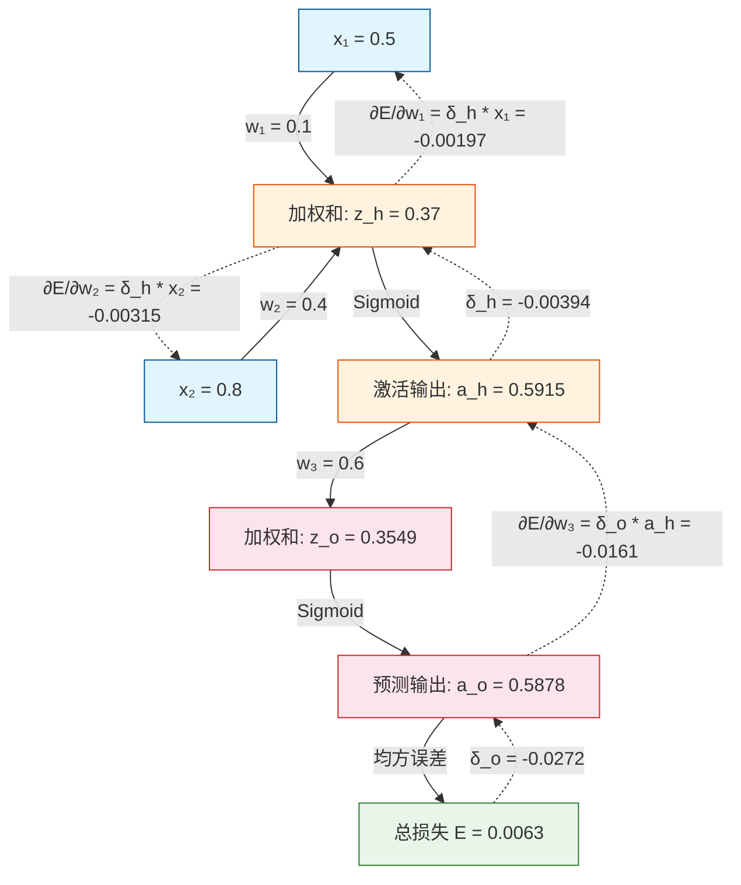

---

### 1. 网络结构与初始值设定

- **输入**：\( x_1 = 0.5 \)，\( x_2 = 0.8 \)（样本特征）
- **真实标签**：\( y_{true} = 0.7 \)
- **权重**（随机初始化）：\( w_1 = 0.1 \)（连接\( x_1 \)到隐藏层），\( w_2 = 0.4 \)（连接\( x_2 \)到隐藏层），\( w_3 = 0.6 \)（连接隐藏层到输出）
- **偏置**：全部设为 \( 0 \)（简化计算）
- **激活函数**：隐藏层和输出层都用 **Sigmoid**，公式 \( \sigma(z) = \frac{1}{1+e^{-z}} \)
- **损失函数**：均方误差 \( E = \frac{1}{2}(y_{true} - y_{pred})^2 \)（加1/2是为了求导消去平方系数）

---

### 2. 第一步：前向传播（算预测值）

**① 隐藏层加权和（\( z_h \)）**  
\[
z_h = (w_1 \cdot x_1) + (w_2 \cdot x_2) = (0.1 \times 0.5) + (0.4 \times 0.8) = 0.05 + 0.32 = 0.37
\]
- **符号含义**：\( z_h \) 是隐藏层神经元**未激活**时的加权输入。

**② 隐藏层激活输出（\( a_h \)）**  
\[
a_h = \sigma(z_h) = \frac{1}{1+e^{-0.37}} \approx 0.5915
\]
- **符号含义**：\( a_h \) 是隐藏层神经元**激活后**传给下一层的实际数值。

**③ 输出层加权和（\( z_o \)）**  
\[
z_o = w_3 \cdot a_h = 0.6 \times 0.5915 = 0.3549
\]

**④ 输出层激活输出（\( a_o \)）= 预测值（\( y_{pred} \)）**  
\[
a_o = \sigma(z_o) = \frac{1}{1+e^{-0.3549}} \approx 0.5878
\]

**⑤ 计算总误差（\( E \)）**  
\[
E = \frac{1}{2}(y_{true} - a_o)^2 = \frac{1}{2}(0.7 - 0.5878)^2 = \frac{1}{2}(0.1122)^2 \approx 0.0063
\]

---

### 3. 第二步：反向传播（算三个权重的偏导数）

核心公式：**链式法则** = 上游误差信号 × 激活函数斜率 × 输入值。

#### ▶️ 先算输出层的误差信号（\( \delta_o \)）
\[
\delta_o = \frac{\partial E}{\partial z_o} = \underbrace{(a_o - y_{true})}_{\text{损失求导}} \times \underbrace{a_o(1-a_o)}_{\text{Sigmoid斜率}}
\]
代入：\( (0.5878 - 0.7) \times 0.5878 \times (1-0.5878) = (-0.1122) \times 0.2423 \approx -0.0272 \)
- **符号含义**：\( \delta_o \) 代表输出层**对总误差的敏感度**，负数表示输出偏低，需要调大权重。

---

#### ▶️ 计算 \( w_3 \) 的偏导数（输出层权重）
\[
\frac{\partial E}{\partial w_3} = \delta_o \times a_h = (-0.0272) \times 0.5915 \approx -0.0161
\]
- **解释**：\( a_h \) 是这条权重“收到”的输入值。梯度为负，意味着**增大 \( w_3 \)** 可以降低误差。

---

#### ▶️ 反向传到隐藏层：算隐藏层误差信号（\( \delta_h \)）
\[
\delta_h = \frac{\partial E}{\partial z_h} = \underbrace{(\delta_o \times w_3)}_{\text{输出层传回的误差}} \times \underbrace{a_h(1-a_h)}_{\text{隐藏层Sigmoid斜率}}
\]
代入：\( (-0.0272 \times 0.6) \times 0.5915 \times (1-0.5915) = (-0.0163) \times 0.2416 \approx -0.00394 \)
- **符号含义**：把输出层的敏感度 \( \delta_o \) 乘以连线权重 \( w_3 \)，“分摊”给隐藏层，再乘以其斜率。

---

#### ▶️ 计算 \( w_1 \) 和 \( w_2 \) 的偏导数
- **对于 \( w_1 \)**（连接 \( x_1 \)）：
\[
\frac{\partial E}{\partial w_1} = \delta_h \times x_1 = (-0.00394) \times 0.5 \approx -0.00197
\]

- **对于 \( w_2 \)**（连接 \( x_2 \)）：
\[
\frac{\partial E}{\partial w_2} = \delta_h \times x_2 = (-0.00394) \times 0.8 \approx -0.00315
\]

---

### 4. 最终汇总与更新（假设学习率 \( \eta = 0.5 \)）

| 权重 | 偏导数（梯度） | 更新后新权重 = 旧权重 - \( \eta \times \) 梯度 |
| :--- | :--- | :--- |
| \( w_3 \) | -0.0161 | \( 0.6 - 0.5 \times (-0.0161) = 0.6081 \) |
| \( w_1 \) | -0.00197 | \( 0.1 - 0.5 \times (-0.00197) = 0.1010 \) |
| \( w_2 \) | -0.00315 | \( 0.4 - 0.5 \times (-0.00315) = 0.4016 \) |

因为预测值（0.5878）低于真实值（0.7），三个梯度均为负，所以**所有权重都增加**（负负得正），下一轮预测会变大，误差随之下降。

---

